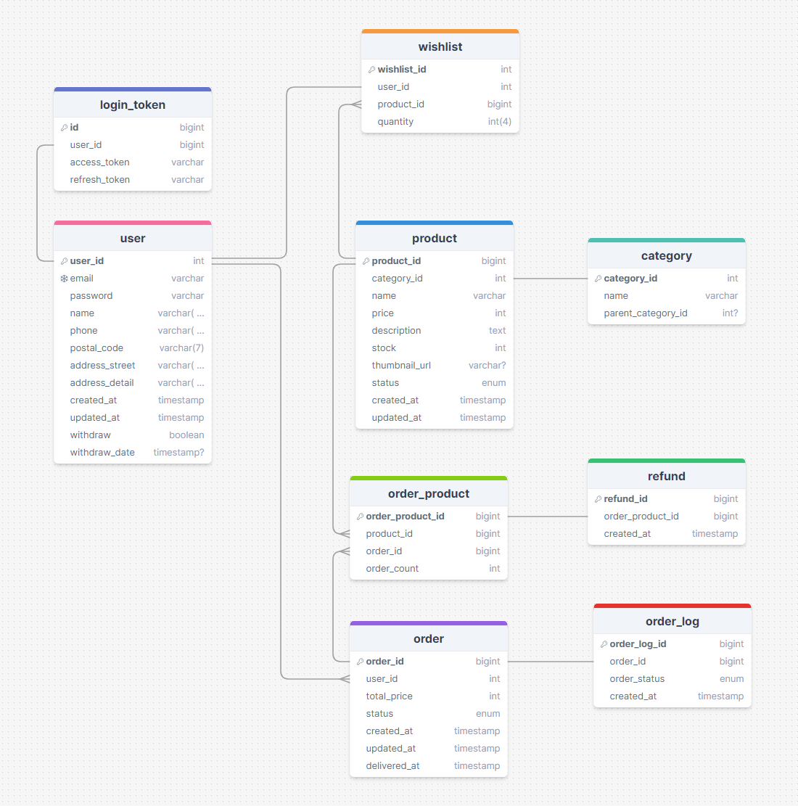

# 예약구매 프로젝트
## 프로젝트 소개
- 개발 기간 : 2024. 04 ~ 진행 중
- 특정 시간에 오픈하는 상품 예약 구매 서비스
- 대규모 트래픽 처리를 위한 MSA 채택

---

## 주요 기능
1. 회원 가입 및 로그인 기능
   - 회원 정보 암호화하여 적용
2. 상품 주문 기능
   - 상품 재고를 Redis로 관리하여 실시간 적용

---

## 개발 환경
- Java 21
- IntelliJ IDEA

## 기술 스택

 

---

## 아키텍처
작성중 (이미지 추가)

---

## 설치 방법
### 사전 환경 구성
작성중
### 

---

## API 명세
작성중 (Spring Rest Docs 적용 예정)

---

## 기술적 의사결정
### MSA 적용 시 연관관계 도메인 분리

---

## 트러블 슈팅
작성중

---

## 성능 개선
### 실시간 재고 관리를 위한 Redis 적용

---

## ERD

